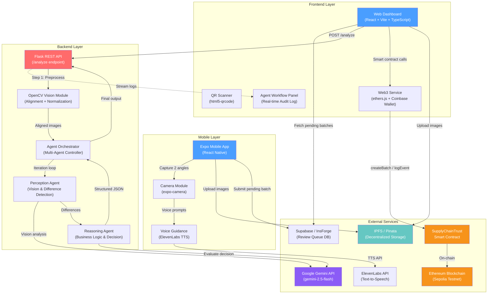
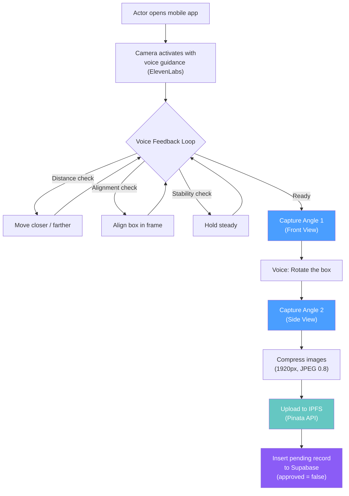
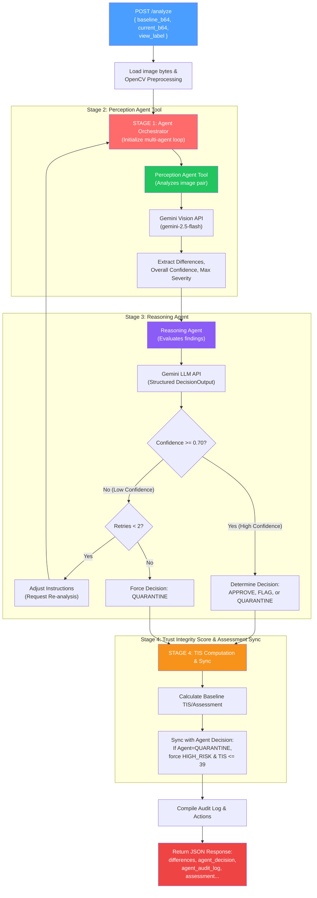
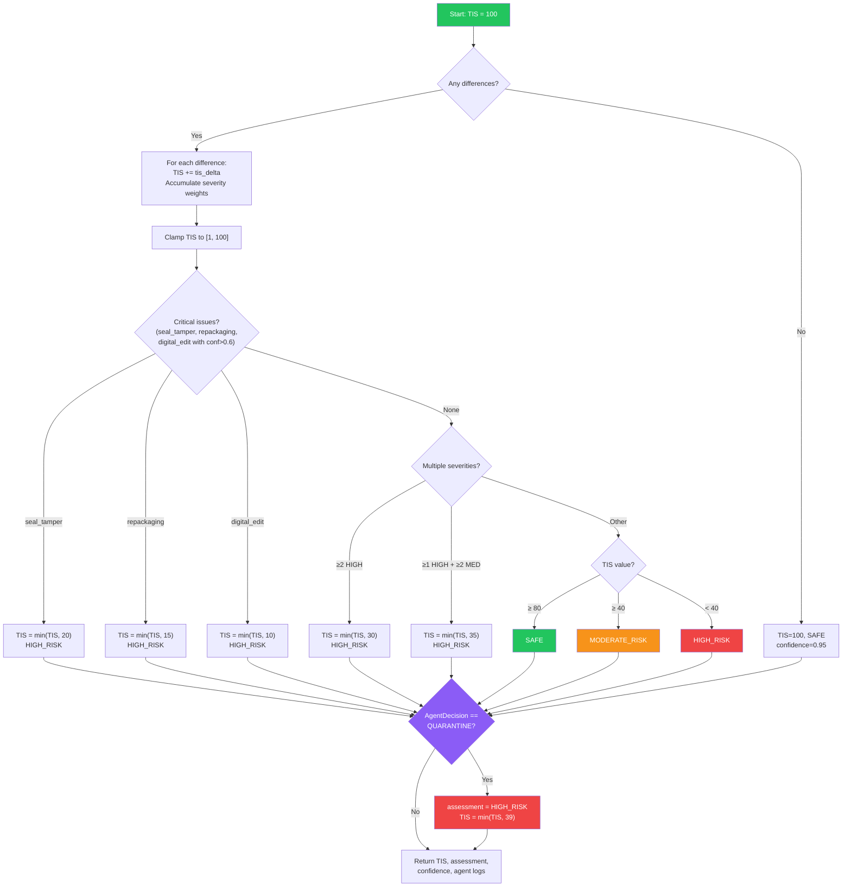
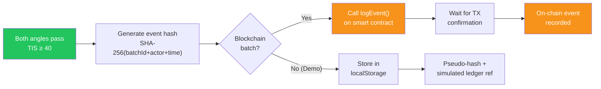

# Boxity: QR-Based Supply Chain Provenance and Package Integrity Verification System

## Detailed Methodology (IEEE Format)

---

## I. INTRODUCTION

Boxity is a multi-platform supply chain provenance system that combines **QR-based product tracking**, **AI-powered visual integrity analysis**, **decentralized storage (IPFS)**, and **blockchain-anchored event logging** to provide end-to-end tamper detection and custody verification for physical goods. The system employs a three-tier architecture consisting of a mobile capture application, a web-based administrative dashboard, and a backend AI/Computer Vision analysis engine.

### A. Problem Statement

Modern supply chains face significant challenges in verifying product integrity across multiple custody transfers. Traditional methods rely on manual inspection and paper-based documentation, which are susceptible to fraud, tampering, and human error. There is a critical need for an automated, AI-driven, and cryptographically verifiable system that can detect physical package tampering at each point of custody transfer.

### B. Objectives

1. Develop a dual-angle image capture mechanism for comprehensive package inspection.
2. Implement an Agentic AI integrity analysis pipeline utilizing a Perception Agent (for vision & differences) and a Reasoning Agent (for autonomous decision-making), combined with OpenCV preprocessing.
3. Compute a quantitative *Trust Integrity Score (TIS)* to provide a standardized assessment of package condition.
4. Record all custody events immutably using blockchain smart contracts (Ethereum/Sepolia) and decentralized file storage (IPFS via Pinata).
5. Provide real-time verification and transparent audit trails accessible to all supply chain stakeholders.

---

## II. SYSTEM ARCHITECTURE

### A. High-Level Architecture Diagram



### B. Technology Stack

| Layer | Technology | Purpose |
|:------|:-----------|:--------|
| **Mobile App** | Expo (React Native) + expo-camera + expo-av | Dual-angle image capture with voice guidance |
| **Web Frontend** | React + Vite + TypeScript + TailwindCSS + shadcn/ui | Admin dashboard, event logging, verification |
| **Backend API** | Flask (Python) | REST API for image integrity analysis |
| **Computer Vision** | OpenCV (cv2) + NumPy | Image alignment, normalization, preprocessing |
| **Agentic AI** | Google Gemini + LangChain | Orchestrated Perception & Reasoning Agents |
| **Blockchain** | Solidity Smart Contract on Ethereum Sepolia | Immutable batch and event ledger |
| **Web3 Bridge** | ethers.js + Coinbase Wallet SDK | Browser-to-blockchain interaction |
| **Decentralized Storage** | Pinata → IPFS | Content-addressed image and metadata storage |
| **Database** | Supabase (PostgreSQL) | Review queue for pending mobile submissions |
| **Voice Guidance** | ElevenLabs TTS API | Real-time audio feedback during mobile capture |
| **Authentication** | Auth0 (optional) | User identity and role management |
| **Animations** | Framer Motion | Smooth UI interactions and transitions |

---

## III. METHODOLOGY

The Boxity system methodology is structured into six sequential phases that together form the complete supply chain provenance workflow. Each phase is described below with its constituent processes and data flows.

### Phase 1: Batch Registration and QR Identity Assignment

**Input:** Product details (name, SKU, origin), two baseline images (Angle 1 and Angle 2).

**Process:**
1. An authorized administrator connects their Ethereum wallet (Coinbase Wallet) via the web dashboard.
2. The admin creates a new product batch by providing product metadata and uploading two baseline reference images to IPFS via Pinata.
3. The `SupplyChainTrust.createBatch()` smart contract function is invoked on the Ethereum Sepolia testnet, storing the batch ID, product metadata, baseline IPFS hashes, creator address, and creation timestamp on-chain.
4. A unique QR code is generated encoding the batch metadata in JSON format. This QR code travels physically with the product throughout the supply chain.

**Output:** On-chain batch record, downloadable QR code (PNG), IPFS-pinned baseline images.


---

### Phase 2: Mobile Image Capture and Submission

**Input:** Physical product with attached QR code.

**Process:**
1. A supply chain actor (Manufacturer, 3PL, Warehouse, Distributor, Retailer) opens the Expo mobile app and initiates a capture session.
2. The app activates the device camera with optional ElevenLabs voice guidance that provides real-time audio feedback:
   - `"Move closer to the box"` / `"Move farther from the box"` (distance guidance)
   - `"Align the box within the frame"` (framing guidance)
   - `"Hold steady"` / `"Ready to capture"` (capture readiness)
   - `"Rotate the box"` (second angle prompt)
3. The actor captures **two images** from different angles (Angle 1: front view, Angle 2: rotated/side view).
4. Images are compressed (resized to 1920px width, JPEG quality 0.8) and uploaded to IPFS via the Pinata API.
5. A pending review record is inserted into the Supabase `batches` table with `approved = false`, containing the batch ID and both IPFS CIDs.

**Output:** Two IPFS-pinned images, a pending review record in Supabase.



---

### Phase 3: Web Review and Integrity Analysis Initiation

**Input:** Pending batch records from Supabase, baseline images from smart contract.

**Process:**
1. The web dashboard polls the Supabase `batches` table every 4 seconds for pending records (`approved = false`).
2. A reviewer selects a pending submission and the system automatically fetches the baseline images from the on-chain batch record via `web3Service.getBatch()`.
3. The reviewer initiates the integrity analysis by clicking "Analyze Integrity," which triggers the sequential analysis of both angles.
4. For each angle, the system:
   - Fetches both the baseline image (from IPFS/smart contract) and the current image (from the mobile submission) as base64 data URIs.
   - Sends a POST request to the backend `/analyze` endpoint with the image pair and view label (`"angle_1"` or `"angle_2"`).

**Output:** Two separate API calls to the backend analyzer (one per angle).

---

### Phase 4: Agentic AI-Powered Integrity Analysis (Backend Pipeline)

This is the core analytical engine of the system. The backend processes each angle independently through a multi-agent orchestrated pipeline.

#### Complete Image Analysis Pipeline



#### Stage 1: OpenCV Preprocessing (`vision.py`)

The preprocessing stage normalizes both images to enable accurate comparison by mitigating environmental differences (lighting, angle, distance).

| Step | Operation | Parameters | Purpose |
|:-----|:----------|:-----------|:--------|
| 1 | Image Decoding | `cv2.imdecode(IMREAD_COLOR)` | Convert raw bytes to BGR matrices |
| 2 | Resolution Matching | `cv2.resize(INTER_AREA)` | Resize current image to baseline dimensions |
| 3 | Feature Detection | ORB (1500 features), SIFT (1000 features) | Detect keypoints for alignment |
| 4 | Feature Matching | BFMatcher + KNN (k=2) + Lowe's Ratio Test | Find corresponding points between images |
| 5 | Homography Estimation | RANSAC (threshold=3.0, maxIters=2000, ≥8 inliers) | Compute geometric transformation |
| 6 | Perspective Warping | `cv2.warpPerspective()` | Spatially align current to baseline |
| 7 | Color Space Conversion | BGR → LAB | Separate luminance from chrominance |
| 8 | Adaptive Histogram Equalization | CLAHE (clipLimit=3.0, tileGrid=8×8) on L channel | Normalize illumination |
| 9 | Contrast Enhancement | `cv2.equalizeHist()` + weighted blend (0.8 original + 0.2 equalized) | Enhance structural visibility |
| 10 | Output Encoding | JPEG quality=95 | Encode normalized images |

#### Stage 2: Perception Agent & Stage 3: Reasoning Agent (`agent.py`)

##### Prompt Structure (Detailed Breakdown)

The prompt sent to Google Gemini is a carefully engineered multimodal prompt consisting of several structured components:

```mermaid
flowchart TD
    subgraph "Prompt Assembly"
        direction TB
        SYS["1. SYSTEM ROLE DEFINITION<br/>Expert multimodal forensic analyst<br/>specializing in package integrity"]
        MISSION["2. MISSION STATEMENT<br/>Compare baseline vs current<br/>package photos"]
        FOCUS["3. CRITICAL FOCUS RULES<br/>• IGNORE background<br/>• IGNORE camera angle/lighting<br/>• IGNORE minor changes<br/>• IGNORE tape issues<br/>• ONLY flag MAJOR structural damage"]
        TARGETS["4. DETECTION TARGETS<br/>• repackaging<br/>• label_mismatch<br/>• digital_edit<br/>• dent<br/>• edge_distortion<br/>• corner_distortion"]
        REGIONS["5. REGION SPECIFICATION<br/>• left/right side<br/>• top/bottom edge<br/>• front/back panel<br/>• corner (specific)<br/>• center"]
        RULES["6. ANALYSIS RULES<br/>• Strict JSON output<br/>• bbox [x,y,w,h] in 0..1 range<br/>• Severity: HIGH/MEDIUM/LOW<br/>• Confidence thresholds<br/>• TIS delta values per type"]
        VIEW["7. VIEW CONTEXT<br/>(angle_1 or angle_2)"]
        FEW["8. FEW-SHOT EXAMPLE<br/>5 sample differences<br/>with complete JSON schema"]
        REINFORCE["9. REINFORCEMENT<br/>Focus ONLY on box<br/>and major threats"]
        IMG1["10. BASELINE IMAGE<br/>(binary + MIME type)"]
        IMG2["11. CURRENT IMAGE<br/>(binary + MIME type)"]
    end

    SYS --> MISSION --> FOCUS --> TARGETS --> REGIONS --> RULES --> VIEW --> FEW --> REINFORCE --> IMG1 --> IMG2

    style SYS fill:#8B5CF6,color:#fff
    style FEW fill:#F7931A,color:#fff
    style IMG1 fill:#4A9EFF,color:#fff
    style IMG2 fill:#EF4444,color:#fff
```



##### Prompt Component 1: System Role

```
You are an expert multimodal forensic analyst specializing in package
integrity and tampering detection.

MISSION: Compare baseline vs current package photos to detect security
breaches and integrity violations.
```

##### Prompt Component 2: Critical Focus Rules (Noise Suppression)

```
- STRICTLY ignore the background of the image. ONLY focus on the box itself.
- STRICTLY ignore differences in camera angle, lighting, or perspective.
- STRICTLY ignore small, minor changes (e.g., tiny specks, minor scratches).
- STRICTLY ignore any tapes, tape peeling, or tape misalignments on the box.
- ONLY flag MAJOR structural changes: edge distortion, corner distortion,
  dents, or severe damage.
```

##### Prompt Component 3: Detection Targets

| Type | Description | TIS Delta |
|:-----|:-----------|:----------|
| `repackaging` | Different packaging, missing elements, structural changes | -33.4 |
| `label_mismatch` | Altered, replaced, or counterfeit labels | -33 |
| `digital_edit` | Photo manipulation, cloning, artificial modifications | -22 |
| `dent` | Physical damage from impact or compression | -17 |
| `edge_distortion` | Significant crushing/bending/damage to edges | -23.3 |
| `corner_distortion` | Significant crushing or damage to corners | -20.5 |

##### Prompt Component 4: Output Schema Specification

```json
{
  "differences": [
    {
      "id": "d1",
      "region": "top edge",
      "bbox": [0.12, 0.03, 0.76, 0.08],
      "type": "seal_tamper",
      "description": "Seal gap visible with lifted flap...",
      "severity": "HIGH",
      "confidence": 0.84,
      "explainability": ["gap at seam", "edge discontinuity", "lifted flap"],
      "suggested_action": "Immediate quarantine",
      "tis_delta": -40
    }
  ]
}
```

##### Gemini Model Configuration

| Parameter | Value | Rationale |
|:----------|:------|:----------|
| Model | `gemini-2.5-flash` | Optimized for speed with multimodal capability |
| Temperature | `0.15` | Low randomness for deterministic forensic analysis |
| Top-K | `20` | Focused token sampling |
| Top-P | `0.8` | Balanced nucleus sampling |
| Response MIME Type | `application/json` | Forces structured JSON output |
| Max Retries | `3` | With exponential backoff for quota management |
| Max Differences | `8` | Capped to prevent noise accumulation |

##### Response Validation and Auto-Repair

After receiving the Gemini response, the system:
1. Strips any markdown code fencing (` ```json ... ``` `)
2. Extracts JSON using regex fallback if malformed
3. Validates against a predefined JSON Schema (`RESPONSE_SCHEMA`)
4. If validation fails, sends a repair prompt back to Gemini asking it to fix the JSON
5. Re-validates the repaired output

#### Stage 4: Trust Integrity Score (TIS) Computation & Synchronization



---

### Phase 5: Event Logging and Blockchain Anchoring

**Input:** Integrity analysis results, actor/role details, image IPFS URLs.

**Process:**
1. If both angles pass integrity (TIS ≥ 40 each), the event is eligible for logging.
2. A cryptographic event hash is generated: `SHA-256(batchId + actor + timestamp)`.
3. For blockchain batches, the `SupplyChainTrust.logEvent()` function is called with:
   - Batch ID, actor name, role, event note
   - Both angle IPFS image URLs
   - Event hash for independent verification
4. The transaction is submitted to Ethereum Sepolia and the system waits for confirmation.
5. For demo-mode batches, events are stored in browser localStorage with pseudo-hashes and simulated ledger references.

**Output:** Immutable on-chain event record, transaction receipt.



---

### Phase 6: Verification and Audit Trail

**Input:** Batch ID (entered manually or scanned from QR code).

**Process:**
1. A verifier enters a Batch ID on the verification page or scans the QR code attached to the product.
2. The system retrieves the complete batch record and all associated events from the smart contract via `getBatchWithEvents()`.
3. An interactive timeline is rendered showing every custody transfer event with:
   - Timestamp and actor/role information
   - Event hash for cryptographic verification
   - Links to IPFS-stored images for each angle
   - Ledger reference (transaction ID)
4. Each event's hash can be independently verified by recomputing it from the stored event data.

**Output:** Complete, auditable custody timeline with cryptographic proofs.

---

## IV. COMPLETE END-TO-END SYSTEM FLOW

```mermaid
flowchart TD
    subgraph "Phase 1: Registration"
        P1A["Admin creates batch<br/>(web dashboard)"]
        P1B["Upload baseline images<br/>to IPFS"]
        P1C["Record on blockchain<br/>(createBatch)"]
        P1D["Generate QR code"]
    end

    subgraph "Phase 2: Capture"
        P2A["Actor scans QR /<br/>opens mobile app"]
        P2B["Capture Angle 1<br/>(with voice guidance)"]
        P2C["Capture Angle 2<br/>(with voice guidance)"]
        P2D["Upload to IPFS"]
        P2E["Submit to Supabase<br/>(approved=false)"]
    end

    subgraph "Phase 3: Review"
        P3A["Web polls Supabase<br/>(every 4s)"]
        P3B["Reviewer selects<br/>pending submission"]
        P3C["Fetch baseline from<br/>smart contract"]
    end

    subgraph "Phase 4: Multi-Agent Analysis"
        P4A["Agent Orchestrator:<br/>Analyze Angle 1"]
        P4B["Agent Orchestrator:<br/>Analyze Angle 2"]
        P4C{"Decisions = APPROVE<br/>& Both TIS ≥ 40?"}
    end

    subgraph "Phase 5: Logging"
        P5A["Generate event hash"]
        P5B["Call logEvent()<br/>on blockchain"]
        P5C["Approve in Supabase"]
    end

    subgraph "Phase 6: Verify"
        P6A["Scan QR / Enter<br/>Batch ID"]
        P6B["Retrieve full event<br/>timeline from chain"]
        P6C["Display verified<br/>custody trail"]
    end

    P1A --> P1B --> P1C --> P1D
    P1D -->|"QR on product"| P2A
    P2A --> P2B --> P2C --> P2D --> P2E
    P2E --> P3A --> P3B --> P3C
    P3C --> P4A --> P4B --> P4C
    P4C -->|"Yes (Pass)"| P5A --> P5B --> P5C
    P4C -->|"No (Fail)"| REJECT["Reject submission<br/>Request re-capture"]
    P5C --> P6A --> P6B --> P6C

    style P1C fill:#F7931A,color:#fff
    style P4A fill:#8B5CF6,color:#fff
    style P4B fill:#8B5CF6,color:#fff
    style P5B fill:#F7931A,color:#fff
    style REJECT fill:#EF4444,color:#fff
    style P6C fill:#22C55E,color:#fff
```



---

## V. DATA MODELS

### A. On-Chain Batch Structure (Solidity)

```solidity
struct Batch {
    string id;              // Unique batch identifier (e.g., "CHT-001-ABC")
    string productName;     // Product name (e.g., "VitaTabs 10mg")
    string sku;             // Stock keeping unit
    string origin;          // Manufacturer / origin info
    uint256 createdAt;      // Block timestamp at creation
    string firstViewBaseline;   // IPFS URL for Angle 1 baseline
    string secondViewBaseline;  // IPFS URL for Angle 2 baseline
    address creator;        // Ethereum address of batch creator
    bool exists;            // Existence flag for mapping lookups
}
```

### B. On-Chain Event Structure (Solidity)

```solidity
struct BatchEvent {
    uint256 id;             // Auto-incrementing event ID
    string actor;           // Actor name performing the custody transfer
    string role;            // Role: Manufacturer, 3PL, Warehouse, etc.
    uint256 timestamp;      // Block timestamp at event creation
    string note;            // Description of the custody event
    string firstViewImage;  // IPFS URL for Angle 1 current image
    string secondViewImage; // IPFS URL for Angle 2 current image
    string eventHash;       // SHA-256 hash for verification
    address loggedBy;       // Ethereum address that logged the event
}
```

### C. Integrity Analysis Response Schema

```json
{
  "differences": [{
    "id": "string",
    "region": "string",
    "bbox": [x, y, w, h],
    "type": "repackaging | label_mismatch | digital_edit | dent | edge_distortion | corner_distortion",
    "description": "string",
    "severity": "HIGH | MEDIUM | LOW",
    "confidence": 0.0-1.0,
    "explainability": ["string"],
    "suggested_action": "string",
    "tis_delta": "number"
  }],
  "aggregate_tis": 0-100,
  "overall_assessment": "SAFE | MODERATE_RISK | HIGH_RISK",
  "confidence_overall": 0.0-1.0,
  "notes": "string",
  "can_upload": true/false,
  "agent_decision": "APPROVE | QUARANTINE | REANALYZE",
  "agent_iterations": "integer",
  "agent_audit_log": ["array of agent iteration records"],
  "analysis_metadata": {
    "total_differences": "integer",
    "high_severity_count": "integer",
    "medium_severity_count": "integer",
    "low_severity_count": "integer",
    "analysis_timestamp": "ISO string",
    "scoring_version": "cv-gemini-v1",
    "cv_used": true/false
  }
}
```

---

## VI. SECURITY CONSIDERATIONS

1. **On-Chain Access Control:** The `SupplyChainTrust` smart contract implements role-based access via `onlyOwner` and `onlyAuthorized` modifiers. Only authorized addresses can create batches or log events.
2. **Cryptographic Hashing:** Each event is hashed using SHA-256, enabling independent verification of event integrity.
3. **Immutability:** Once logged on the Ethereum blockchain, events cannot be altered or deleted.
4. **Decentralized Storage:** Images stored on IPFS are content-addressed, ensuring that any modification to the image changes the CID, making tampering detectable.
5. **API Key Security:** Google Gemini API keys and Pinata JWTs are stored as environment variables and never exposed to the client.

---

## VII. LIMITATIONS AND FUTURE WORK

1. **Demo-Mode Persistence:** The current demo mode uses browser `localStorage`, which is not suitable for production deployment.
2. **Single-Chain Deployment:** The system currently targets Ethereum Sepolia testnet; mainnet deployment and multi-chain support are planned.
3. **Gemini API Rate Limits:** The system implements retry logic with exponential backoff but may face throughput limitations under high-volume usage.
4. **Mobile Feature Detection:** MediaPipe integration for advanced box detection and framing guidance is partially implemented.
5. **OpenCV Alignment Fallback:** If feature matching fails (insufficient keypoints or matches), the system falls back to raw image comparison, potentially reducing analysis accuracy.

---

## VIII. REFERENCES

1. Google Generative AI (Gemini) Documentation — https://ai.google.dev/docs
2. OpenCV Feature Detection and Description — https://docs.opencv.org/
3. Ethereum Solidity Documentation — https://docs.soliditylang.org/
4. IPFS (InterPlanetary File System) — https://docs.ipfs.tech/
5. Pinata IPFS Pinning API — https://docs.pinata.cloud/
6. ElevenLabs Text-to-Speech API — https://docs.elevenlabs.io/
7. Supabase (PostgreSQL Backend) — https://supabase.com/docs
8. Expo (React Native Framework) — https://docs.expo.dev/
9. ethers.js (Ethereum Library) — https://docs.ethers.org/
10. Coinbase Wallet SDK — https://docs.cloud.coinbase.com/wallet-sdk/

---

*Document generated from source code analysis of the Boxity project repository.*
*Scoring Version: cv-gemini-v1*
