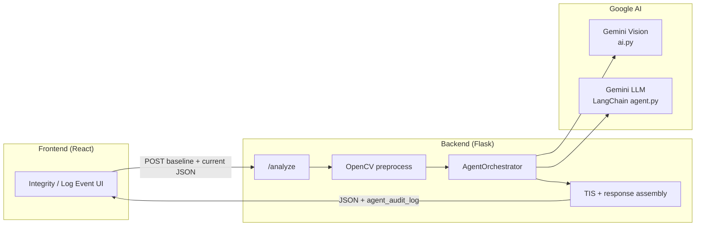
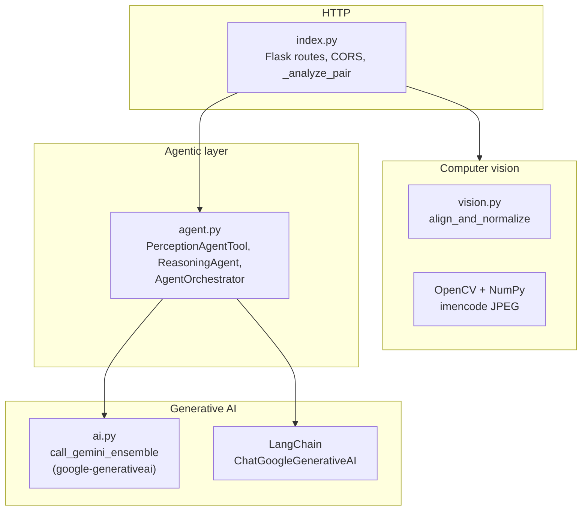
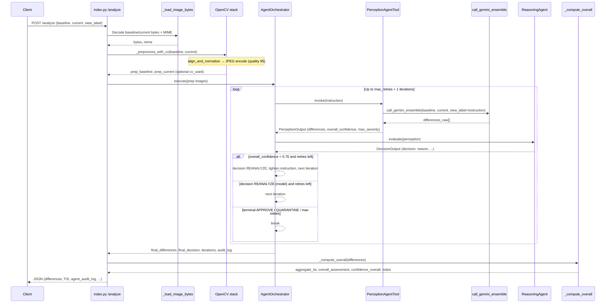
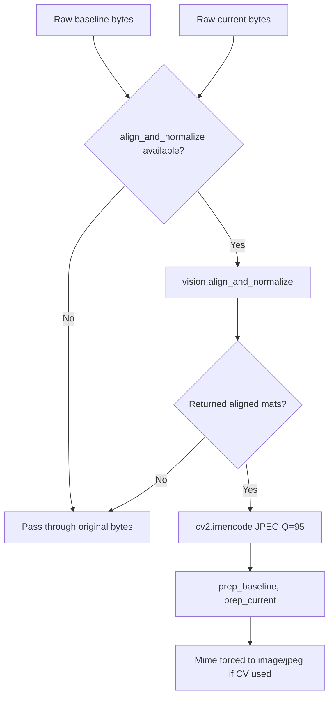
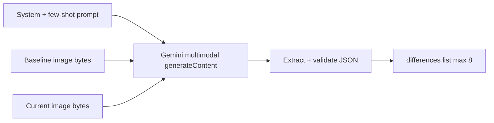
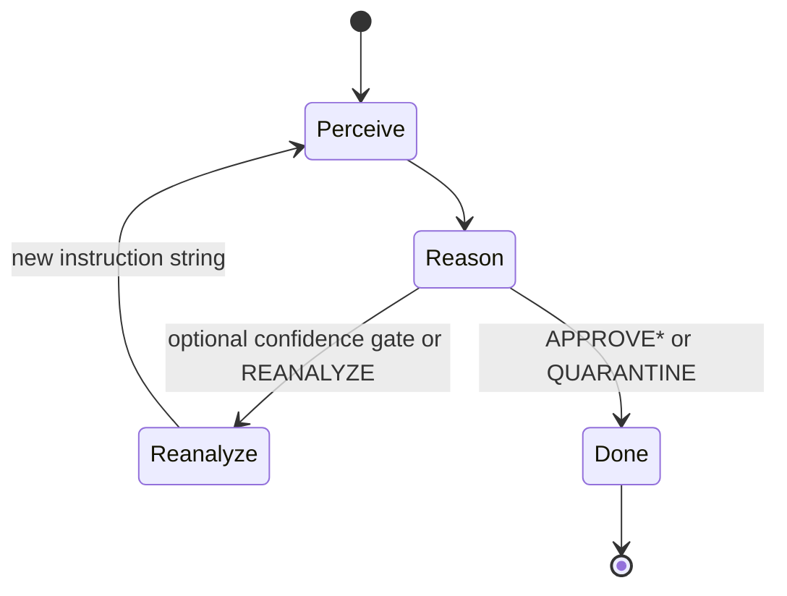
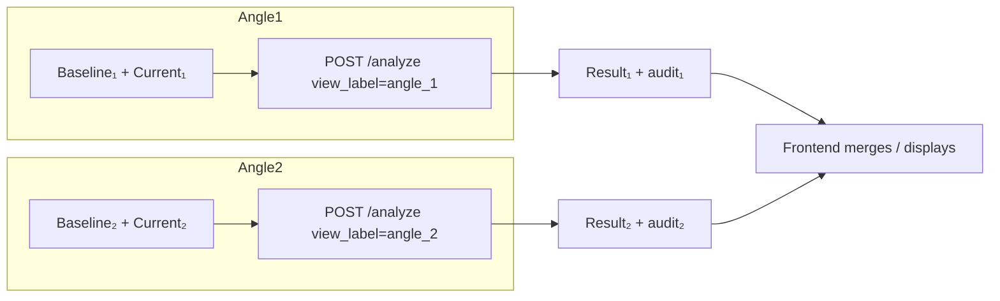

# Boxity — System Design & Architecture

This document describes the **end-to-end system design** for the Boxity capstone stack: web client, Flask backend, **OpenCV** preprocessing, **Gemini (GenAI)** perception and reasoning agents, and how responses flow back for UI and optional blockchain workflows.

---

## 1. High-level system context

| Layer | Role |
|--------|------|
| **Client** | React/Vite SPA: image capture or upload, displays TIS, differences, and **agent workflow** (when `agent_audit_log` is present). |
| **API** | Flask app (`boxity_backend/api/index.py`): `/analyze` accepts **one baseline + one current** pair per request; multi-angle flows call the API **twice** (e.g. `angle_1`, `angle_2`). |
| **Vision (OpenCV)** | Aligns and normalizes image pairs before GenAI to reduce pose/lighting variance (`vision.align_and_normalize` + `cv2.imencode`). |
| **GenAI — Perception** | `google-generativeai` multimodal call in `api/ai.py` (`call_gemini_ensemble`): structured JSON list of differences. |
| **GenAI — Reasoning** | LangChain + `ChatGoogleGenerativeAI` in `api/agent.py`: structured decision (`APPROVE`, `QUARANTINE`, `REANALYZE`, etc.). |
| **Scoring** | Server-side **Trust Integrity Score (TIS)** and labels (`SAFE` / `MODERATE_RISK` / `HIGH_RISK`) from normalized difference list (`_compute_overall`). |



---

## 2. Backend module map



| File | Responsibility |
|------|----------------|
| `api/index.py` | Load images (base64 / URL), OpenCV prep, invoke orchestrator or fallback, TIS, JSON response. |
| `api/vision.py` | Geometric alignment and photometric normalization of baseline vs current (feeds stable pixels to Gemini). |
| `api/ai.py` | Vision model prompt + JSON extraction + schema repair; returns `differences[]`. |
| `api/agent.py` | Wraps perception as a tool; reasoning loop with confidence threshold and `REANALYZE`; emits `audit_log`. |
| `api/schema.py` | JSON schema for validating model output (used in `ai.py`). |

---

## 3. Request lifecycle: `POST /analyze`

### 3.1 Input contract

Typical body (single angle):

```json
{
  "baseline_b64": "data:image/jpeg;base64,...",
  "current_b64": "data:image/jpeg;base64,...",
  "view_label": "angle_1"
}
```

The route also accepts alternate field aliases (e.g. `baseline_url`, `current_url`, `baseline_angle1`) for backward compatibility.

### 3.2 Sequence diagram



---

## 4. OpenCV preprocessing flow (detail)

Purpose: **reduce nuisance variation** (rotation, scale, illumination) so the vision model focuses on **package structure**, not background or mild viewpoint drift.



**Observability:** `analysis_metadata.cv_used` indicates whether preprocessed bytes differed from the originals.

**Failure mode:** Any exception or `None` from alignment → **graceful fallback** to original images (analysis still runs).

---

## 5. GenAI flow (two complementary paths)

### 5.1 Perception — `api/ai.py` (`call_gemini_ensemble`)

- **Library:** `google.generativeai` (`GenerativeModel`).
- **Input:** Baseline and current image **bytes + MIME**, optional `view_label` / instruction string (appended to prompt context).
- **Output:** List of difference objects (region, type, severity, confidence, bbox, tis_delta, explainability, …).
- **Robustness:** JSON parse + optional schema repair; retries on quota (`ResourceExhausted`).



### 5.2 Reasoning — `api/agent.py` (`ReasoningAgent`)

- **Library:** LangChain `ChatGoogleGenerativeAI` with **`with_structured_output(DecisionOutput)`**.
- **Input:** Serialized perception summary (differences text, `overall_confidence`, `max_severity`).
- **Output:** `DecisionOutput`: `decision`, `reason`, `confidence_assessment`.
- **Policy interaction:** A **hard rule** can override: if mean perception confidence &lt; **0.70**, force **`REANALYZE`** (with refined instruction) until retries are exhausted, then finalize conservatively.



---

## 6. Agent orchestration — audit log & iterations

Each loop adds structured entries to `agent_audit_log`:

| Step | Typical fields |
|------|----------------|
| Perception | `agent`, `step: perception`, `iteration`, `action`, `output` (differences + `overall_confidence` + `max_severity`), `timestamp` |
| Reasoning | `agent`, `step: reasoning`, `iteration`, `action` (e.g. normal evaluate vs confidence gate), `output` (decision object), `timestamp` |

**`agent_iterations`** is derived from the orchestrator loop index (max reasoning iteration number), not from duplicate log lines.

The HTTP response includes:

- `agent_decision` — final decision string from the orchestrator  
- `agent_iterations` — number of agent loop iterations used  
- `agent_audit_log` — full trace for frontend “Agentic Workflow” UI  

---

## 7. Scoring & compatibility layer

After the agent returns `final_differences`, `index.py`:

1. Normalizes each item (`_normalize_diff_item`).
2. Tags each difference with `view` = `view_label` for multi-angle merging on the client.
3. Computes **`aggregate_tis`**, **`overall_assessment`**, **`confidence_overall`**, **`notes`** via `_compute_overall`.
4. Applies a **safety bridge**: if scores look `SAFE` but agent **`QUARANTINE`**, assessment can be escalated to **`HIGH_RISK`** and TIS capped.
5. Sets **`can_upload`** (e.g. TIS ≥ threshold) for gating uploads in the app.

---

## 8. Multi-angle client pattern



Each call runs the **full pipeline** (OpenCV → agents → TIS) independently so failures, quotas, or retries are **per angle**.

---

## 9. Environment & operations

| Variable | Purpose |
|----------|---------|
| `GOOGLE_API_KEY` or `GEMINI_API_KEY` | Gemini access for both `google-generativeai` and LangChain. |
| `FLASK_APP` | e.g. `api.index:app` for `flask run`. |

**Production note:** Prefer a WSGI server (e.g. Gunicorn) behind HTTPS; keep API keys out of client bundles.

---

## 10. Slide-ready summary bullets (2–3 slides)

**Slide A — System architecture**  
- Three tiers: React client, Flask API, Google Gemini (vision + reasoning).  
- One REST endpoint per angle; OpenCV stabilizes pixels before AI.  
- Responses combine **numeric TIS**, **structured differences**, and **agent audit trail**.

**Slide B — OpenCV vs GenAI**  
- OpenCV: alignment + normalization + JPEG packaging — **input hygiene**.  
- Gemini vision: **detect** tamper/damage as JSON — **perception**.  
- Gemini + LangChain structured output: **decide** approve / quarantine / reanalyze — **reasoning**.

**Slide C — Agent loop**  
- Iterative **perception → reasoning**; automatic **re-analysis** when confidence rules Fire.  
- Full transparency via **`agent_audit_log`** for capstone demo and stakeholder trust.

---

*Generated for the Boxity capstone codebase. Diagrams use [Mermaid](https://mermaid.js.org/); render in GitHub, VS Code, or export to images for PowerPoint.*
